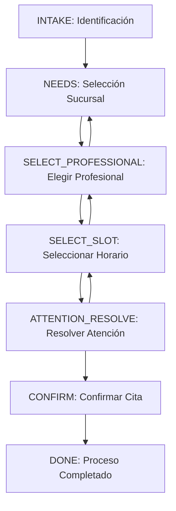

# 🏥 Funnel de Agendamiento Médico (healthcare_medilink)

## 📋 Descripción General

El funnel `healthcare_medilink` está diseñado específicamente para el agendamiento de citas médicas con integración Medilink. Permite a los pacientes agendar citas de forma automatizada a través de WhatsApp, con un bot inteligente que guía todo el proceso.

## 🎯 Objetivos

- **Automatizar** el proceso de agendamiento de citas médicas
- **Integrar** con el sistema Medilink para operaciones reales
- **Guiar** al paciente paso a paso de forma intuitiva
- **Validar** información médica importante
- **Confirmar** todos los detalles antes de crear la cita

## 🔄 Flujo del Funnel



## 📊 Etapas del Funnel

### 1. **INTAKE** - Identificación del Paciente
**Propósito**: Identificar o registrar al paciente en el sistema

**Acciones**:
- Buscar paciente existente por teléfono o RUT
- Validar formato de teléfono (E.164)
- Validar formato de RUT chileno
- Crear nuevo paciente si no existe

**Validaciones**:
- Teléfono debe incluir código de país (+56)
- RUT debe tener formato válido
- Email debe ser válido (opcional)

**Herramientas utilizadas**:
- `search_patient`: Buscar paciente existente

### 2. **NEEDS** - Selección de Sucursal
**Propósito**: Permitir al paciente elegir la sucursal donde desea atenderse

**Acciones**:
- Listar sucursales disponibles
- Mostrar información de cada sucursal
- Permitir selección de sucursal

**Herramientas utilizadas**:
- `list_branches`: Obtener sucursales disponibles

### 3. **SELECT_PROFESSIONAL** - Selección de Profesional
**Propósito**: Permitir al paciente elegir el profesional médico

**Acciones**:
- Listar profesionales de la sucursal seleccionada
- Mostrar especialidades disponibles
- Permitir selección de profesional

**Herramientas utilizadas**:
- `list_professionals`: Obtener profesionales por sucursal

### 4. **SELECT_SLOT** - Selección de Horario
**Propósito**: Permitir al paciente elegir el horario disponible

**Acciones**:
- Obtener horarios disponibles para el profesional
- Mostrar opciones de fecha y hora
- Validar disponibilidad en tiempo real

**Herramientas utilizadas**:
- `get_available_slots`: Obtener horarios disponibles
- `check_slot_availability`: Verificar disponibilidad

### 5. **ATTENTION_RESOLVE** - Resolución de Atención
**Propósito**: Resolver información específica de la atención médica

**Acciones**:
- Verificar que el horario sigue disponible
- Resolver detalles específicos de la atención
- Preparar datos para la confirmación

**Validaciones**:
- Slot debe seguir disponible
- Información de atención debe ser válida

### 6. **CONFIRM** - Confirmación de Cita
**Propósito**: Crear la cita en el sistema Medilink

**Acciones**:
- Crear la cita en Medilink
- Generar código de confirmación
- Enviar confirmación al paciente

**Herramientas utilizadas**:
- `schedule_appointment`: Crear nueva cita

### 7. **DONE** - Proceso Completado
**Propósito**: Finalizar el proceso y enviar confirmación

**Acciones**:
- Enviar confirmación final
- Proporcionar código de confirmación
- Informar sobre recordatorios

## 🤖 Bot Asistente

### Configuración del Bot
- **Nombre**: Asistente Médico Medilink
- **Modelo**: GPT-4o
- **Temperatura**: 0.7
- **Funciones**: Habilitadas
- **Contexto**: 10 mensajes anteriores

### Prompt del Sistema
```
Eres un asistente especializado en agendamiento de citas médicas. Tu función es ayudar a los pacientes a:

1. Identificarse y registrarse en el sistema médico
2. Seleccionar sucursal donde desean atenderse
3. Elegir profesional según su especialidad
4. Reservar horario disponible
5. Confirmar cita con todos los detalles

## Comportamiento:
- Sé empático y profesional
- Explica claramente cada paso del proceso
- Valida información importante (teléfono, RUT, etc.)
- Ofrece alternativas cuando no hay disponibilidad
- Confirma todos los detalles antes de crear la cita
```

## 🛠️ Herramientas Disponibles

### 1. **search_patient**
Busca un paciente en el sistema Medilink
```typescript
{
  phone: string; // Teléfono en formato E.164
  rut?: string;  // RUT del paciente (opcional)
}
```

### 2. **list_branches**
Obtiene sucursales disponibles
```typescript
{} // Sin parámetros
```

### 3. **list_professionals**
Obtiene profesionales por sucursal
```typescript
{
  branchId: string; // ID de la sucursal
}
```

### 4. **get_available_slots**
Obtiene horarios disponibles
```typescript
{
  professionalId: string; // ID del profesional
  branchId: string;       // ID de la sucursal
  startDate?: string;     // Fecha inicio YYYY-MM-DD
  endDate?: string;       // Fecha fin YYYY-MM-DD
}
```

### 5. **schedule_appointment**
Crea nueva cita médica
```typescript
{
  patientId?: string;     // ID del paciente
  professionalId: string; // ID del profesional
  branchId: string;       // ID de la sucursal
  dateYmd: string;        // Fecha YYYY-MM-DD
  timeHhmm: string;       // Hora HH:MM
  duration?: number;      // Duración en minutos
  patientData?: {         // Datos del paciente si no existe
    name: string;
    lastName: string;
    phone: string;
    email?: string;
    rut?: string;
    birthDate?: string;
  };
}
```

### 6. **reschedule_appointment**
Reagenda cita existente
```typescript
{
  appointmentId: string;  // ID de la cita
  newDateYmd: string;     // Nueva fecha YYYY-MM-DD
  newTimeHhmm: string;    // Nueva hora HH:MM
}
```

### 7. **cancel_appointment**
Cancela cita existente
```typescript
{
  appointmentId: string; // ID de la cita
  reason?: string;       // Motivo de cancelación
}
```

### 8. **get_patient_appointments**
Obtiene citas de un paciente
```typescript
{
  patientId: string; // ID del paciente
  status?: string;   // Filtrar por estado
}
```

## 📝 Contexto del Funnel

### Estructura del Contexto
```typescript
interface HealthcareMedilinkContext {
  // Datos del paciente
  patientData?: {
    phoneE164: string;
    name?: string;
    lastName?: string;
    rut?: string;
    email?: string;
    birthDate?: string;
    medilinkPatientId?: string;
  };

  // Preferencias de agenda
  preferences?: {
    branchId?: string;
    branchName?: string;
    professionalId?: string;
    professionalName?: string;
    specialty?: string;
    preferredDates?: string[];
    preferredTimes?: string[];
  };

  // Selecciones actuales
  selections?: {
    branchId?: string;
    professionalId?: string;
    chairId?: string;
    dateYmd?: string;
    timeHhmm?: string;
    duration?: number;
    attentionId?: string;
  };

  // Slots disponibles
  availableSlots?: Array<{
    id: string;
    date: string;
    time: string;
    professionalId: string;
    professionalName: string;
    branchId: string;
    branchName: string;
    chairId: string;
    duration: number;
  }>;

  // Resultado de la cita
  appointment?: {
    id: string;
    confirmationCode?: string;
    status: string;
    createdAt: Date;
  };

  // Estado del funnel
  currentStage: HealthcareMedilinkStage;
  sessionId?: string;
  companyId: string;
  channelId: string;
  clientId: string;
  
  // Flags de control
  needsHumanIntervention?: boolean;
  humanInterventionReason?: string;
  retryCount?: number;
  lastError?: string;
}
```

## ⚙️ Configuración

### Variables de Entorno Requeridas
```bash
# Medilink API
MEDILINK_BASE_URL=https://api.medilink.healthatom.com/api/v1
MEDILINK_RATE_LIMIT_RPM=20

# Encriptación
MEDILINK_ENCRYPTION_KEY_B64=tu_clave_aqui

# WhatsApp (opcional)
WA_TEMPLATE_CITA_CREADA=cita_creada
WA_TEMPLATE_CITA_REAGENDADA=cita_reagendada
WA_TEMPLATE_CITA_ANULADA=cita_anulada
```

### Configuración del Bot
```typescript
{
  model: 'gpt-4o',
  temperature: 0.7,
  maxTokens: 2000,
  functionsEnabled: true,
  contextWindow: 10,
  retryAttempts: 3,
  timeoutMs: 30000,
  customSettings: {
    validatePhoneFormat: true,
    validateRutFormat: true,
    requireConfirmation: true,
    maxBookingDays: 30,
    minAdvanceHours: 2,
    sendWhatsAppConfirmation: true,
    businessHours: {
      start: '08:00',
      end: '20:00',
      timezone: 'America/Santiago',
    },
    workingDays: [1, 2, 3, 4, 5],
    defaultAppointmentDuration: 30,
  }
}
```

## 🔄 Transiciones Válidas

### Flujo Principal
- `INTAKE` → `NEEDS` (cuando se identifica al paciente)
- `NEEDS` → `SELECT_PROFESSIONAL` (cuando se selecciona sucursal)
- `SELECT_PROFESSIONAL` → `SELECT_SLOT` (cuando se selecciona profesional)
- `SELECT_SLOT` → `ATTENTION_RESOLVE` (cuando se selecciona horario)
- `ATTENTION_RESOLVE` → `CONFIRM` (cuando se resuelve la atención)
- `CONFIRM` → `DONE` (cuando se confirma la cita)

### Flujo de Regreso
- `SELECT_PROFESSIONAL` → `NEEDS` (cambiar sucursal)
- `SELECT_SLOT` → `SELECT_PROFESSIONAL` (cambiar profesional)
- `ATTENTION_RESOLVE` → `SELECT_SLOT` (cambiar horario)

## ⏱️ Timeouts por Etapa

- **INTAKE**: 10 minutos
- **NEEDS**: 5 minutos
- **SELECT_PROFESSIONAL**: 5 minutos
- **SELECT_SLOT**: 5 minutos
- **ATTENTION_RESOLVE**: 2 minutos
- **CONFIRM**: 3 minutos
- **DONE**: 1 minuto

## 🚨 Manejo de Errores

### Errores Comunes
1. **Paciente no encontrado**: Se crea nuevo registro
2. **No hay sucursales**: Mensaje informativo
3. **No hay profesionales**: Sugerir otra sucursal
4. **No hay horarios**: Sugerir otro profesional
5. **Slot no disponible**: Mostrar alternativas
6. **Error al crear cita**: Reintentar o contactar soporte

### Intervención Humana
Se requiere intervención humana cuando:
- `needsHumanIntervention = true`
- `retryCount > 3`
- Error en `ATTENTION_RESOLVE` sin `attentionId`

## 📊 Métricas

### Métricas Trackeadas
- `funnel_start_time`: Tiempo de inicio del funnel
- `funnel_completion_time`: Tiempo de finalización
- `funnel_abandonment_stage`: Etapa donde se abandonó
- `funnel_retry_count`: Número de reintentos
- `funnel_human_intervention`: Si requirió intervención humana
- `appointment_created`: Cita creada exitosamente
- `appointment_cancelled`: Cita cancelada

## 🧪 Testing

### Casos de Prueba
1. **Flujo completo exitoso**
2. **Paciente existente vs nuevo**
3. **Sin sucursales disponibles**
4. **Sin profesionales disponibles**
5. **Sin horarios disponibles**
6. **Slot no disponible al confirmar**
7. **Error al crear cita**
8. **Intervención humana**

## 🚀 Deployment

### Pasos para Activar
1. Ejecutar migración de tablas Medilink
2. Ejecutar migración de funnel y etapas
3. Configurar variables de entorno
4. Conectar integración Medilink
5. Asociar funnel a canal de WhatsApp
6. Probar flujo completo

### Verificación
```bash
# Verificar que el funnel existe
SELECT * FROM funnel WHERE name = 'Funnel de Agendamiento Médico';

# Verificar etapas creadas
SELECT * FROM stage WHERE funnelId = (SELECT id FROM funnel WHERE name = 'Funnel de Agendamiento Médico');

# Verificar bot creado
SELECT * FROM ai_bot WHERE name = 'Asistente Médico Medilink';

# Verificar funciones del bot
SELECT * FROM bot_function WHERE botId = (SELECT id FROM ai_bot WHERE name = 'Asistente Médico Medilink');
```

## 📞 Soporte

### Logs Importantes
- `HealthcareMedilinkRunners`: Ejecución de etapas
- `MedilinkTools`: Herramientas del bot
- `MedilinkService`: Operaciones con API

### Troubleshooting
1. Verificar conexión con Medilink
2. Validar variables de entorno
3. Revisar logs de errores
4. Verificar disponibilidad de API
5. Comprobar configuración del bot

---

**Estado**: ✅ Implementado y listo para usar
**Versión**: 1.0.0
**Última actualización**: 24 de Octubre de 2025
